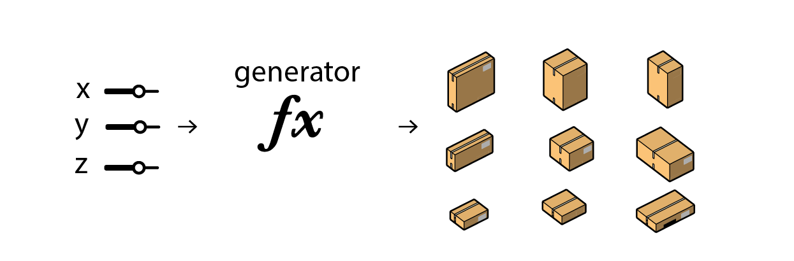

# 什么是遗传算法

生成器是生成设计方案的逻辑途径。换句话说，它们是算法的引擎，由它们生成出方案让程序的评估器去评估。 

生成器可以非常简单，例如，一个产生随机设计方案的函数；它们也可以非常复杂，例如，随着时间的推移而学习神经网络。无论他们的复杂程度如何，他们总体上都会以用户期望的任何形式生成新数据。 

在前面看到的表示例中，生成器是创建不同表设计的代码块。在另一个示例中，生成器可以吐出一系列平面图。 

在下面的简单Dynamo示例中，突出显示的节点充当生成器并在图像中创建长方体。它采用输入值并使用这些变量生成设计选项。 

当值更改并重新运行程序时，将再次调用生成器节点以创建新的设计选项。在生成的设计过程中，此生成器可以是单个功能，也可以是组合在一起的一系列功能，它们会产生数百个甚至数千个不同的选项。

